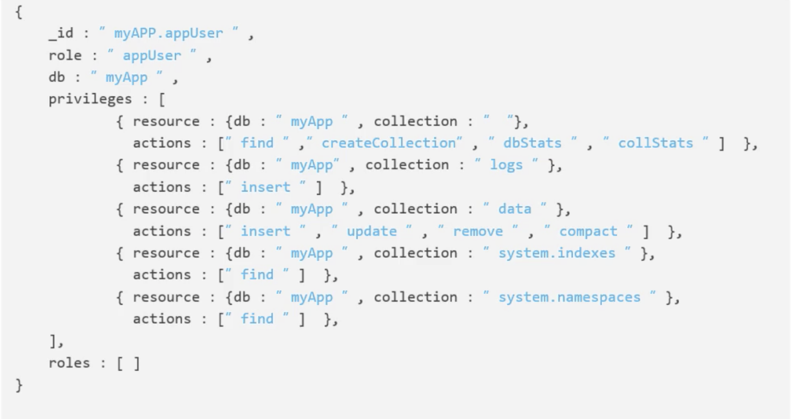

#MongoDB安全

* MongoDB安全概览
    1. 最安全的是物理隔离：不现实
    2. 网络隔离其次：
    3. 防火墙隔离其次
    4. 用户名密码在最后
    
* 物理隔离与网络隔离
* IP白名单隔离
* 用户名密码鉴权

一、开启权限认证

1. auth开启
    
    mongod.conf增加
    
    auth = true 开启用户鉴权
    
    重启mongod服务
    查找进程号
    ps aux|grep mongod
    kill -2 pid号
    启动mongod
    mongod -f mongod.conf
    
二、创建用户

1. 创建语法：createUser(2.6之前为addUser)
2. {user:<name>,
        pwd:<cleartext password>,
        customData:{<any information>},
        roles:[{role:"<role>",db:"<database>"}]
        }
3. 角色类型： 内建类型(read,readWrite,dbAdmin,dbOwner,userAdmin)
        
            创建lz用户密码123 对admin数据库有管理员权限
            db.createUser({user:"lz",pwd:"123",roles:[{role:"userAdmin",db:"admin"}]})
            Successfully added user: {
            	"user" : "lz",
            	"roles" : [
            		{
            			"role" : "userAdmin",
            			"db" : "admin"
            		}
            	]
            }
            
            创建yuonly用户密码123 对admin数据库有管理员权限，对test数据库有读取权限
            db.createUser({user:"yuonly",pwd:"123",roles:[{role:"userAdmin",db:"admin"},{role:"read",db:"test"}]})
            Successfully added user: {
            	"user" : "yuonly",
            	"roles" : [
            		{
            			"role" : "userAdmin",
            			"db" : "admin"
            		},
            		{
            			"role" : "read",
            			"db" : "test"
            		}
            	]
            }

    *** 开启权限验证，并且创建完用户之后，如果无用户密码链接数据库，可以正常链接，但是无法进行操作
    
    
                yudeMacBook-Pro:mongodb_simple yu$ mongo localhost:12345
                MongoDB shell version v3.4.1
                connecting to: mongodb://localhost:12345
                MongoDB server version: 3.4.1
                > use admin
                switched to db admin
                > show tables
                2017-02-09T17:01:28.882+0800 E QUERY    [main] Error: listCollections failed: {
                	"ok" : 0,
                	"errmsg" : "not authorized on admin to execute command { listCollections: 1.0, filter: {} }",
                	"code" : 13,
                	"codeName" : "Unauthorized"
                } :
三、使用创建的账号密码链接数据库

            yudeMacBook-Pro:mongodb_simple yu$ mongo localhost:12345 -u yuonly -p 123
            MongoDB shell version v3.4.1
            connecting to: mongodb://localhost:12345
            MongoDB server version: 3.4.1
            > use test
            switched to db test
            > show tables
            city
            
            
四、用户角色(超级角色 root __system)
1. 数据库角色（read,readWrite,dbAdmin,dbOwner,userAdmin）
2. 集群角色(clusterAdmin,clusterManager)
3. 备份角色(backup,restore)
4. 其他特殊角色(DBAdminAnyDatabases...)

* 创建角色
    

    
